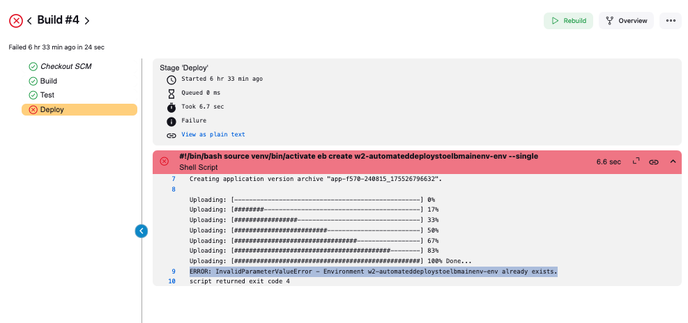
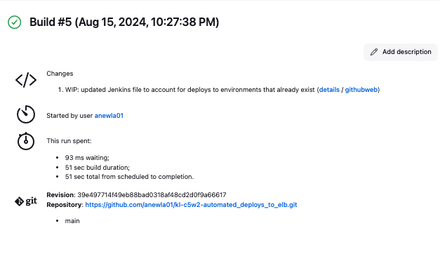
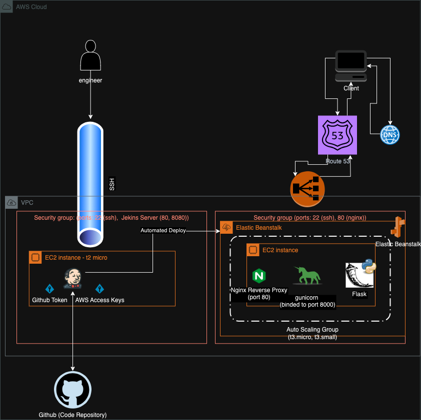

# Overview

Business use case: A Retail Bank wants to deploy an application to the cloud
that is fully managed by AWS.

This document serves as notes, and reflections on deploying the infrastructure
needed to meet the business needs described above.

Complete Tech Stack:

Cloud: AWS

- Jenkins: for pipeline build, and deployment to Elastic Beanstalk (EB)
- Elastic Beanstalk (EB): auto scaling and code deployment to machines
- Application: REST Flask app (Python)
- venv: python environment manager, used to ensure that the code that is
  being executed will leverage the correct dependencies.

## Purpose

In this workstream we manually deployed Jenkins on a manually provisioned EC2
instance, and improved upon the previous
[workstream](https://github.com/anewla01/kl-c5w1-elastic_beanstalk/blob/main/README.md)
by enabling Jenkins to deploy successful builds to Elastic Bean Stalk.

# Infrastructure Walkthrough

## 1. Standing up Jenkins Server

A Jenkins server was launched on an EC2 t2.micro following the same procedure
from the previous workload. The github repository was attached via a github
personal access token.

The Jenkins user is then password protected as it will have access to critical
AWS credentials. AWS offers a credentialing procedure similar to that of a user
name and password. The AWS Access Key is a public identifier that corresponds to
an IAM user or role, and the AWS Secret Access Key is effectively the password.
These credentials need to be securely managed, as the key pair will give the
holder the same access as the underlying user or role.

The AWS CLI is then installed, and is appropriately configured for the Jenkins
user, leveraging the AWS credentials that have provisioned for this deployment.

## 2. Configuring Jenkins + Initializing Elastic Beanstalk Applicaition

This Jenkins pipeline consists of three stages: `Build`, `Test`, and `Deploy`.
During the `Build` step, a python virtual environment is created, and all
underlying requirements are installed. This provides two pieces of meaningful
functionality:

1. It acts as a sanity check that the `requirements.txt` has been properly
   configured (e.g: there aren't any dependency conflicts that would break
   farther downstream during the deploy)
2. It creates an isolated area where the dependencies for the application will
   be kept. Python dependencies stored in the venv are kept separately from the
   other environments and the remainder of the python dependencies available to the
   broader system.

Ultimately, the python virtual environment ensures general consistency when
developing, and launching an application.

In the `Test` phase a script: `system_resources_test.sh` is used to measure the
health of the Jenkins server before attempting to deploy. This is helpful in
scenarios where we suspect that our server may be under significant duress and
incapable of continuing with the other portions of the CICD pipeline. In this
scenario, we leverage exit codes in order to properly indicate that the script
has not met it's successful state. Jenkins picks up on failures of this script
and will hault the pipeline. Additional configuration could be done to trigger
an alert to operational owners.

`Deploy` is the final stage of the Jenkins pipeline. It has been configured to
verify that the EB environment is already available, otherwise it will seek to
create a new one, given the hardcoded environment name. A manual step to
initialize EB was taken before the `Deploy` stage could successfully run. EB
command line tools were installed within the necessary python virtual
environment, and then commands were executed to create an EB application from
the CLI.

_NOTE: after this failure, the Jenkins file was updated to handle deploys to environments that 
already exist_

# Systems Diagram

# Conclusion

Automated Deploys within a CICD pipeline can remove manual overhead from SDLC and allow for 
smoother releases of changes to production. Having this system entirely automated means that 
important features can be provided to downstream users with minimal delay. This speed, however,
comes with additional risks. The key concern is that the automated CICD will deploy changes to 
production that are not in fact ready to be deployed or have catastrophic issues within it. This
could stem from several areas:
1. CICD does not have reasonable testing infrastructure to verify that the system in and of itself
is working correctly. Often times there is an extreme amount of focus on testing for the 
application code, but the code that powers the CICD similarly needs robust testing. 
2. Application code does not have enough meaningful tests, such tha the CICD `Test` phase of the 
pipeline cannot appropriately capture for issues.

Both of these issues are resolved by having increasing the requirements around code quality. In 
addition, production deployments should be done in a blue/green deploy or canary deploy manner, this 
way the business can reduce the risk of releasing breaking code.

## Discrete Optimizations

In this workstream we made efforts to further automate the procedures used in
the previous deployment. There are a few places that still have manual effort
and could be further improved upon.

The introduction of Terraform would be incredibly beneficial to this process.
This would allow for spinning up of the EC2 instances that are running Jenkins
and any other additional provisioning necessary. Instance profiles, or IAM roles
should be investigated to allow for pass through of meaningful credentials
directly to the EC2 instance, without having to manage AWS access keys.

The EB application was initialized manually from the CLI, which is a big
improvement from using the UI, however, this step should be made easily
reproducible in the form of a script (likely using Terraform). Additionally,
changes should be made to the repository to include the necessary packages that
are used for the deploy process (e.g: `awsebcli`). This could be either done by
creating a separate requirements file or by updating the Jenkins file to include
a pip install step. Lastly Jenkins builds were manually kicked off, however, Github could be connected
(likely via Github Actions) to trigger Jenkins builds on commit to the `main` branch
